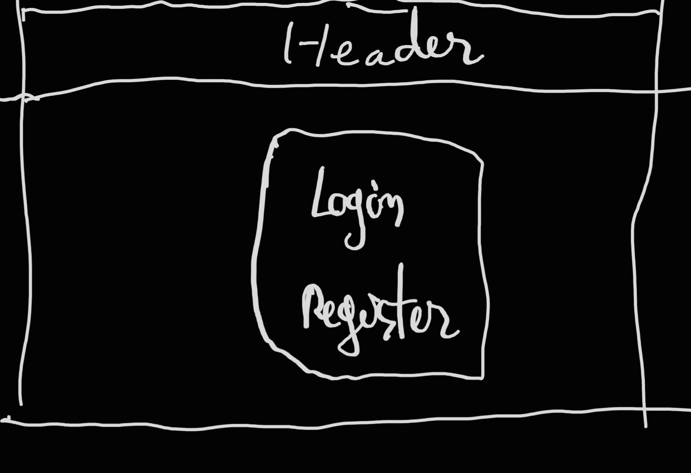

# Markdown Reader

## Overview

This application will allow users to upload markdown files. Users will have 
a list of uploaded files. Clicking on one of these files will display it in the browser as html with a default style template. 

Basically, it will be a markdown repository with visualizing capabilities similar to what VSCode can do.

## Data Model
The application will store Users and Files.

* users can have multiple files (via a list of references)
* the File objects themselves will have references to the user that created them
, the actual file binary, as well as metadata about upload-data (more metadata could be added in later iterations)

```javascript
User {
  username: //,
  hash: //hashed password,
  salt: //password salt,
  files: [] // a list of references to files owned by user
  //possibly add email later
}

File {
  name: //fileName for user reference,
  owner: //reference to user that created the file,
  data: //binary data of actual markdown file (possibly encrypted),
  uploadDate: //,
  size: //size of binary data,
  //possible other metadata
}
```

## [Link to Commented First Draft Schema](db.mjs)

## Wireframes

I apologize for the horrible drawing.

/users/login - login page


/users/register - sign up page


/upload - upload a file


/view - view the actual file


/ - home page


## Site map


## User Stories or Use Cases

1. as non-registered user, I can register a new account with the site
2. as a user, I can log in to the site
3. as a user, I can view my uploaded files
4. as a user, I can upload new files
5. as a user, I can delete an uploaded file

## Research Topics

* (4 points) Integrate user authentication
    * I'm going to be using passport for user authentication
    * I am only going to use Local strategy (no emails), as I would like to post this at some point and I do not trust myself to store actual data

* (2 points) Use more advanced mongoose functionality 
    * custom validators
    * Schema methods
    * populate
* (2 points) Markdown to Html parsing
    * use showdown [showdown](https://github.com/showdownjs/showdown)
* (tentative) React/ NextJs

## [Link to Initial Main Project File](app.mjs)

## Annotations / References Used
1. [passport.js authentication docs](http://passportjs.org/docs) - (add link to source code that was based on this)
2. [showdown](https://github.com/showdownjs/showdown)
