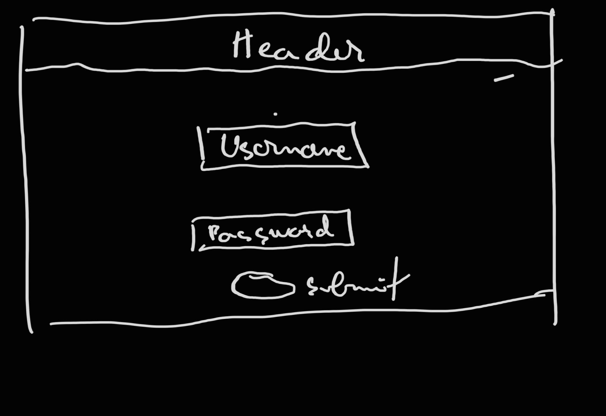
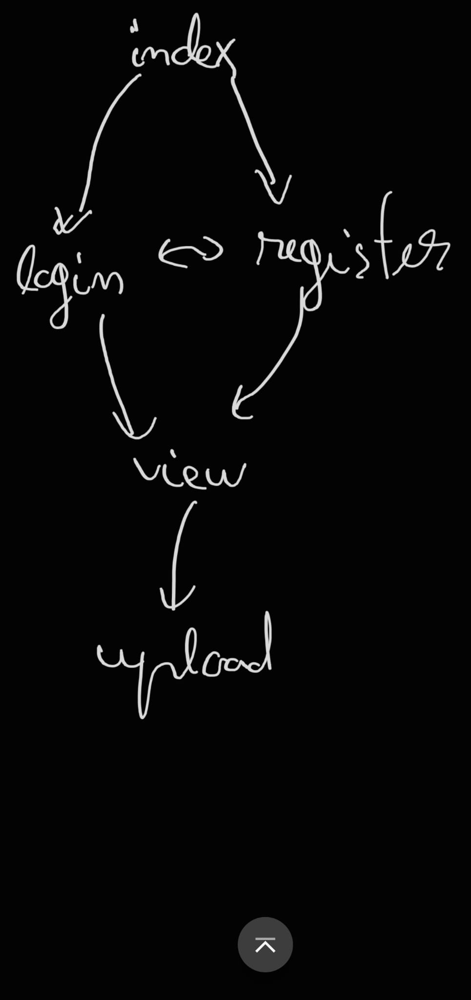

# Markdown Reader

## Overview

This application will allow users to upload markdown files. Users will have 
a list of uploaded files. Clicking on one of these files will display it in the browser as html with a default style template. 

Basically, it will be a markdown repository with visualizing capabilities similar to what VSCode can do.

## Data Model
The application will store Users and Files.

* users can have multiple files (via a list of references)
* the File objects themselves will have references to the user that created them
, the actual file binary, as well as metadata about upload-data (more metadata could be added in later iterations)

```javascript
User {
  username: //,
  hash: //hashed password,
  files: [] // a list of references to files owned by user
  //possibly add email later
}

File {
  name: //fileName for user reference,
  owner: //reference to user that created the file,
  data: //binary data of actual markdown file (possibly encrypted),
  uploadDate: //,
  size: //size of binary data,
  //possible other metadata
}
```

## [Link to Commented First Draft Schema](db.mjs)

## Wireframes

I apologize for the horrible drawing.

/auth/login - login page



/auth/register - sign up page


/dashboard/addFile - upload a file


/dashboard/view - view the actual file


/dashboard - home page


## Site map



## User Stories or Use Cases

1. as a non-registered user, I can register an account with username and password
2. as a user, I can log in
2. as a user, I can view my uploaded files
3. as a user, I can upload new files
4. as a user, I can delete an uploaded file

## Research Topics

As I finally commited to using NextJS, I have to refactor my research topics to reflect the new challenges I'm facing. I will also be using TypeScript instead of JavaScript, with a custom linter configuration provided by `create-next-app`.


1. (4 points) NextJS
    * I think I have a decent working understanding of the fundamentals of the App Router, Data Fetching, and Middleware, and I shall be adding details here as I learn.
    * Next uses file based routing using folders nested in `app`. Each folder has a corresponding `layout.ts` (where components are rendered), `page.tsx` (where the actual jsx is created), and `template.ts` (which is a more dynamic layout).
    * There is also an option to write route handlers, which basically perform express functionality.
    * Middleware is configured in a `middleware.ts` file, which runs before components are rendered. Next provides `NextRequest` and `NextResponse` types, which build upon the built in `Request` and `Response` browser API's.
        * IMPORTANT FACT I DID NOT REALIZE BEFORE: middleware runs as an "edge function", which means that it uses vercel's edge runtime, which is a trimmed down version of node. As such, not every node module is supported here, so it's very important to be mindful of this when writing middleware. I love serverless ! :( 
    * There are two kinds of components, server and client, which come with different advantages and drawbacks. Main difference is that server side components are rendered exclusively on the server (either statically at build time or dynamically at request time, depending on the functionality), so they don't have access to browser api's, async functions, and standard hooks (`useState, useEffect`). Client components on the other hand can be rendered on the client (like normal React), so they have access to these apis. Furthermore, server components do not rerender without a request or redirect, while client components do.  
    * There is also something called a server action, which allows you to post forms to routes without actual api endpoints. That means that in a form's `action` prop, I can simply pass in an async function that runs on the server, without creating a route for the execution of that code. It can also most of what api-routes can do, just without needing an actual endpoint. Pretty neat! (although can be buggy, even though Next says they are stable - they are NOT)

2. (2 points) JWT Authentication with Jose
    * I have decided to give up NextAuthJs, as I kept running into issue after issue. 
    * I will be using a simple username-password jwt based authentication sytem.
        * User can register an account with username and password.
        * The user logs in with username and password and, if successful, receives a jwt token that authenticates him.
        * The token stores his mongodb `ObjectID`, and username. 
        * Currently, there is no protection against CSRF or any mechanism to revoke the token, or any plans to implement this.
        * I might implement token encryption later, but this is still uncertain.
        * The library I will be using for JSON web tokens is `jose`, because it runs on the edge runtime.
    * Add Jose specific info here

3. (1 point) Showdown - Server Side
    * The actual markdown to html parser.
    * This one is very straightfoward to use. Pass in the markdown, get back the html. I have not researched yet if it can handle images well, or how it would handle them, but I will soon get to that as well.
4. (1 point) Universal Cookie - Client Side


## [Link to Initial Main Project File](app/page.tsx)

## Annotations / References Used
1. NextJS
    * [official docs](https://nextjs.org/docs) 

2. Next-Auth 
    * [YouTube Tutorial](https://www.youtube.com/watch?v=MNm1XhDjX1s)
    * [official docs](https://next-auth.js.org/)
    * [example app](https://github.com/nextauthjs/next-auth/blob/main/apps/examples/nextjs/components/auth-components.tsx)

3. Showdown
    * [showdown](https://github.com/showdownjs/showdown)
